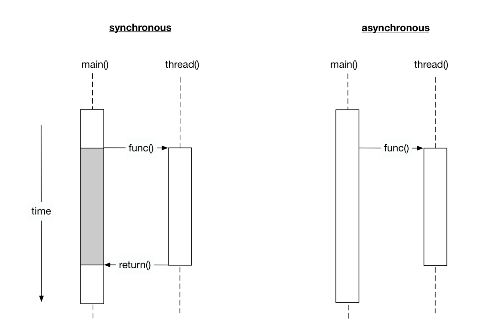
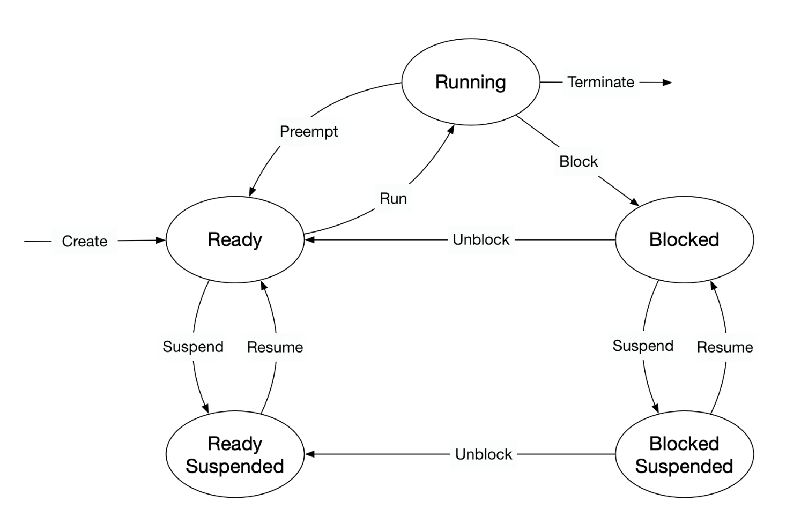
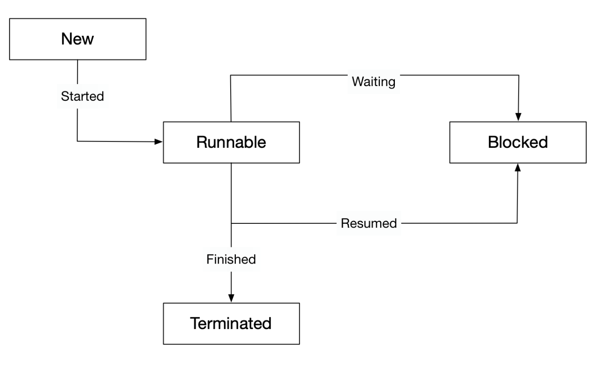
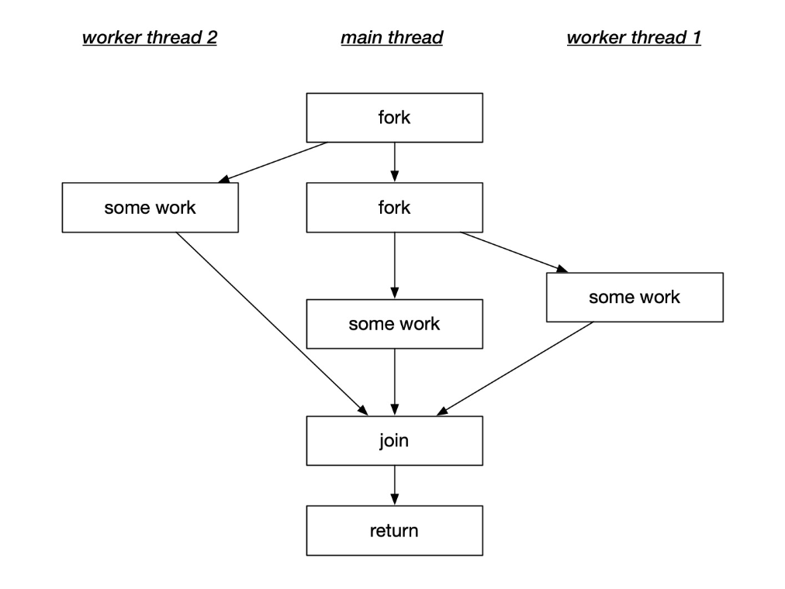

__Asynchronous program__ : The program where code runs concurrently in parallel path of execution is called asynchronous program

__Synchronous program__ : The program where main program waits it's line of execution for the code to run in parallel path of execution is called synchronous program

#### Processes

- A process (also called a _task_) is a computer program at runtime.
- It is comprised of the runtime environment provided by the operating system (OS), as well as of the embedded binary code of the program during execution.
- Processes are managed by the scheduler of the OS. 
- The scheduler can either let a process run until it ends or blocks (_non-interrupting scheduler_), or it can ensure that the currently running process is interrupted after a short period of time.
- The scheduler can switch back and forth between different active processes (_interrupting scheduler_), alternately assigning them CPU time.
- The administration of processes is computationally taxing.

Different states of a process:

- __Ready__ : After its creation, a process enters the ready state and is loaded into main memory. The process now is ready to run and is waiting for CPU time to be executed. Processes that are ready for execution by the CPU are stored in a queue managed by the OS.
- __Running__ : The operating system has selected the process for execution and the instructions within the process are executed on one or more of the available CPU cores.
- __Blocked__ : A process that is blocked is one that is waiting for an event (such as a system resource becoming available) or the completion of an I/O operation.
- __Terminated__ : When a process completes its execution or when it is being explicitly killed, it changes to the "terminated" state. The underlying program is no longer executing, but the process remains in the process table as a "zombie process". When it is finally removed from the process table, its lifetime ends.
- __Ready suspended__ : A process that was initially in ready state but has been swapped out of main memory and placed onto external storage is said to be in suspend ready state. The process will transition back to ready state whenever it is moved to main memory again.
- __Blocked suspended__ : A process that is blocked may also be swapped out of main memory. It may be swapped back in again under the same conditions as a "ready suspended" process. In such a case, the process will move to the blocked state, and may still be waiting for a resource to become available.

##### Threads
- A thread represents a concurrent execution unit within a process.
- Threads are characterized as light-weight processes (LWP).
- All the threads in a process can access its shared memory.
- Threads also share other OS dependent resources such as processors, files, and network connections.
- Threads, however, are not protected against each other and must carefully synchronize when accessing the shared process resources to avoid conflicts.

Different states of a thread:

- __New__ : A thread is in this state once it has been created. Until it is actually running, it will not take any CPU resources.
- __Runnable__ : In this state, a thread might actually be running or it might be ready to run at any instant of time. It is the responsibility of the thread scheduler to assign CPU time to the thread.
- __Blocked__ : A thread might be in this state, when it is waiting for I/O operations to complete. When blocked, a thread cannot continue its execution any further until it is moved to the runnable state again. It will not consume any CPU time in this state. The thread scheduler is responsible for reactivating the thread.

_Note:_ A major difference between a process and a thread is that each process has its own address space, while a thread does not require a new address space to be created.

##### Parallelism in threads

Threads follows "Fork-Join-Parallelism" concept. The basic mechanism of this concept follows a simple three-step pattern:

- Split the flow of execution into a parallel thread ("fork")
- Perform some work in both the main thread and the parallel thread
- Wait for the parallel thread to finish and unite the split flow of execution again ("join")

Once the work is completed in the worker threads, the flow of execution is united again in the main function using the `join()` command